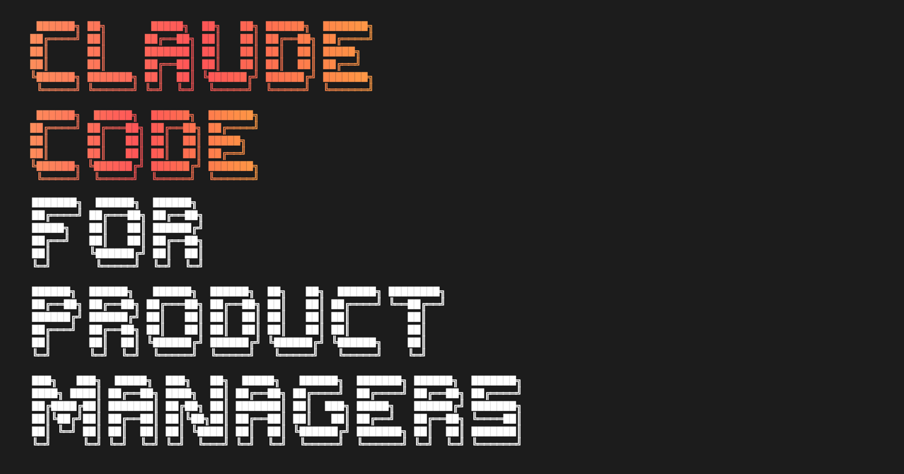

# 0.2: 下载与开始

- **完成时间：** 5 分钟

- **前置条件：** 已安装 Claude Code（[0.1](https://ccforpms.com/getting-started/installation)）

## 下载课程材料

[下载课程材料](https://github.com/carlvellotti/claude-code-pm-course/releases/latest/download/complete-course.zip)

1. 点击上方按钮下载 `complete-course.zip`

2. 将 zip 文件解压到你的 Documents 文件夹

3. 按照以下说明从课程文件夹打开 Claude Code

## 从课程文件夹打开 Claude Code

下载并解压后，你需要在课程文件夹中打开终端：

### 在文件管理器中找到

导航到你的 Documents 文件夹，找到 `complete-course` 文件夹。然后右键点击并选择"在文件夹中打开新终端"

看起来会是这样：



然后输入 `claude` 并按 Enter

### 或者从终端打开

在终端中输入以下命令：

```
cd ~/Documents/complete-course
claude
```

这会导航到你的课程文件夹并直接在其中打开 Claude Code。

**重要：** Claude 只能看到你启动它的文件夹中的文件。始终从课程文件夹启动 Claude Code。

## 开始你的第一课

当 Claude Code 从课程文件夹运行后：

```
/start-1-1
```

Claude 将开始交互式教学。跟随引导并在出现提示时回应。

## 常见问题

### "我可以更改下载位置吗？"

可以，只需记住路径以便在 `cd` 命令中使用。

### "如果下载失败怎么办？"

尝试从 [GitHub Releases](https://github.com/carlvellotti/claude-code-pm-course/releases/latest) 手动下载。

### "我可以暂停并稍后继续吗？"

可以！使用 `/resume` 从上次中断的地方继续，或者直接再次运行该课程的 `/start` 命令。

## 下一步

在 Claude Code 中输入 `/start-1-1` 开始模块 1！

或继续阅读参考指南：[**1.1: 欢迎 →**](https://ccforpms.com/fundamentals/welcome)

**关于本课程**

由 [Carl Vellotti](https://www.linkedin.com/in/carlvellotti/) 创建。如果你对本模块或整个课程有任何反馈，请给我留言！我正在为 PM 构建者打造一个通讯和社区，欢迎查看 [The Full Stack PM](https://fullstackpm.com/subscribe?utm_source=ccforpms&utm_medium=course&utm_campaign=start-and-clone)。

**源仓库：** [github.com/carlvellotti/claude-code-pm-course](https://github.com/carlvellotti/claude-code-pm-course)

[0.1: 安装](https://ccforpms.com/getting-started/installation) [1.1: 欢迎](https://ccforpms.com/fundamentals/welcome)
